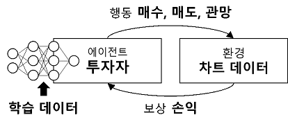
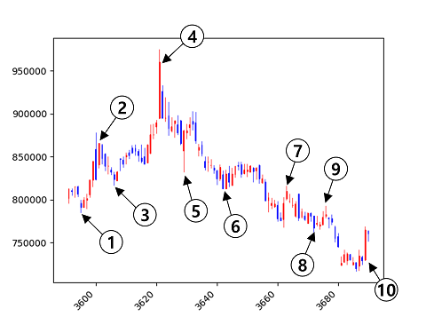
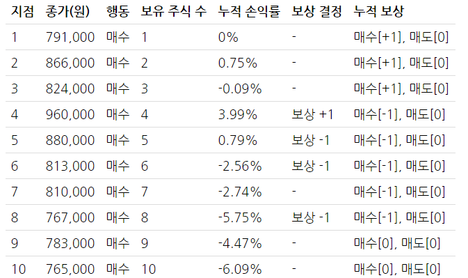
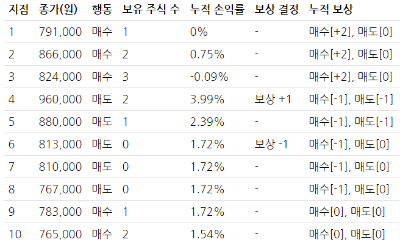
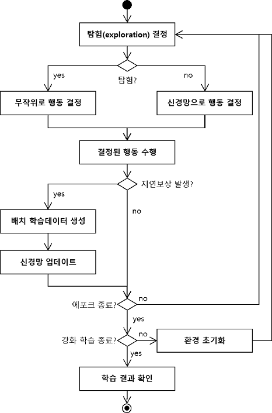
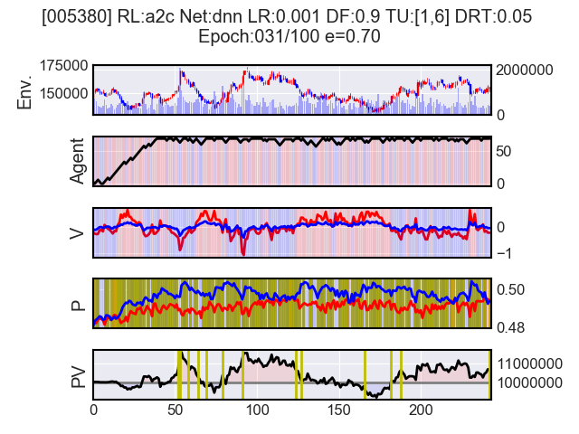

# 04장 배경이론 4: 강화학습을 이용한 주식투자란?

## 직관적으로 강화학습 전략 알아보기
무작정 주식투자를 해보고 경험을 쌓아 잘한 경우에 긍정적으로 보상하고 잘못한 경우엔 부정적으로 보상함으로써 일일이 학습 데이터를 만드는 수고를 없애면서도 효과적으로 주식 투자 머신러닝을 수행할 수 있는 전략

- http://blog.quantylab.com/rl_stock.html

- 행동은 신경망으로 결정하고 신경망은 투자를 진행하면서 발생하는 보상과 학습 데이터로 학습

- 위와 같은 일봉 차트에서 각 숫자로 되어 있는 어느 부분에서 매수/매도/관망을 해야할까?

- 2% 손익이 발생했을 때 보상하는 조건
  - 4번 시점에서 손익이 발생했으므로 1~3번 행동들에 대해서 +1로 보상
  - 5번 시점에서 -3.2% 손실이 발생했으므로 직전 4번 행동을 -1로 보상

- 매수와 매도를 모두 수행
  - 4번 지점에서 3.99% 수익 → 직전 행동까지 +1 보상
  - 6번 지점에서 4번 지점 대비 -2.2% 손실 → 직전 행동까지 -1 보상
- 그런데, 4번/5번 지점에서는 좋은 행동임에도 -1 보상 → 학습을 계속 하다보면 해결됨

## 거래 수수료와 거래세

- 매수 수수료 : 0.015% (증권사별, 최저 0.015% 정도임)
- 매도 수수료 : 0.015% (증권사별, 최저 0.015% 정도임)
- 거래세 : 0.25% (국가 세금, 고정)

## 무작위 행동 결정(탐험, exploration)과 무작위 행동 결정 비율(엡실론, ε)
학습이 정체되지 않도록 하기 위해 무작위 투자 진행 필요

# 강화학습 효과 차별화

## 차별화 요인 #1: 학습 데이터

### 기본 분석 지표
- 주가 수익 비율(Price Earning Ratio, PER) = 주가/주당 순이익
- 주가 순자산 비율(Price Book-value Ratio, PBR) = 주가/주당 순자산
- 자기 자본 이익률(Return On Equity, ROE) = PBR/PER

### 주가 및 거래량 특징
- 전일 종가 대비 당일 시가 비율 (open/last close)
- 당일 종가 대비 당일 고가 비율 (high/close)
- 당일 종가 대비 당일 저가 비율 (low/close)
- 당일 종가 대비 전일 종가 비율 (close/last close)
- 전일 거래량 대비 당일 거래량 비율 (volume/last volume)
- 5/10/20/60/120일 평균 종가 대비 당일 종가 비율 (close/MA5(/10/20/60/120) close)
- 5/10/20/60/120일 평균 거래량 대비 당일 거래량 비율 (volume/MA5(/10/20/60/120) volume)

### 주식 시장 관련 자질
- 코스피 지수의 5/20/60/120일 평균 종가 대비 당일 종가 비율 (close/MA5(/20/60/120) close)

### 이론적으로 국채와 주식은 반대 방향성
- 3년 국채의 5/20/60/120일 평균 종가 대비 당일 종가 비율 (close/MA5(/20/60/120) close)

### 에이전트 상태
- 주식 보유 비율 (현재 보유 주식 수/최대 보유 가능 주식 수)
- 포트폴리오 가치 비율 (현재 포트폴리오 가치/기준 포트폴리오 가치)

## 차별화 요인 #2: 지연 보상 임곗값
강화학습을 진행하면서 학습 수행 여부를 결정하는 기준

- 지연 보상 임곗값 손익률 5%
  - 수익율 5%를 달성하면 이전 투자 행동을 긍정적이라고 학습
  - 손실율 5%를 달성하면 이전 투자 행동을 부정적이라고 학습
- 수익률과 손실률을 다른 수치로 정할 수도 있음
- 또는 긍정적 보상만 하거나 부정적 보상만 할 수도 있음

## 차별화 요인 #3: 행동 종류

- 에이전트의 기본 행동
  - 매수, 매도, 관망
- 세분화 가능
  - 공격적 매수, 방어적 매수, 공격적 매도, 방어적 매도, 관망
- 매매의 최대/최소 투자 단위를 정해서 진행할 수도 있음

## 차별화 요인 #4: 신경망

- 심층 신경망 (deep neural network)
- 순환 신경망 (recurrent neural network)
- 합성곱 신경망 (convolutional neural network)
- 여러 신경망 앙상블 (ensemble)

## 차별화 요인 #5 : 강화학습 기법

- Q-러닝 (Q-Learning)
- 정책 경사 (Policy Gradient)

# 차트 데이터 & 학습 데이터

## 차트 데이터 (original data, raw data)
있는 그대로의 데이터

## 학습 데이터 (pre-processing)
학습에 바로 사용할 수 있는 데이터

# 주식투자 강화학습 절차(process)

- 에포크(epoch) : 학습 데이터 전부를 대상으로 한 차례 반복하는 과정
- 엡실론(epsilon) : 탐험 비율. 경험이 쌓일수록 무작위로 하는 행동을 줄이곤 한다

### 배치 학습 데이터 생성 및 신경망 업데이트
- 지연 보상 기준에 따라 이익 또는 손실이 발생 → 그 때까지의 상황과 행동을 학습 데이터로 생성 → 신경망 업데이트
- 이러한 학습 방법 = 배치(batch) 학습

# 과정 및 결과 확인

## 강화학습 과정을 로그(log)로 남기기
- 파라미터(parameter)
  - 학습 속도 (learning rate)
  - 할인 요인 (discount factor)
  - 최소/최대 투자 단위 (trading unit)
  - 지연 보상 임계치 (delayed reward threshold)
- 에포크(epoch) 결과
  - 몇 번째 에포크인지, 탐험률, 탐험 횟수, 매도/수 횟수, 관망 횟수, 보유 주식 수, 포트폴리오 가치, 긍정/부정적 학습 횟수, 학습 과정에서 발생한 손실 등
- 최종 학습 결과
  - 학습 과정에서 달성한 최대 포트폴리오 가치, 수익 발생 횟수 等 전체 학습이 완료되고 나서야 알 수 있는 통계치

## 이미지로 가시화

