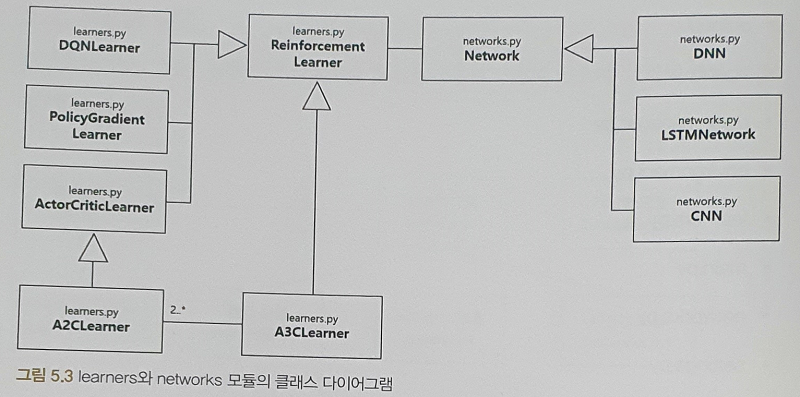

# 05장 모듈 개발: 강화학습 기반 주식투자 시스템 개발


## 소스 코드
- [GitHub](https://github.com/quantylab/rltrader)


## 개발에 필요한 환경

- OS : Windows 10 x64
- IDE : VSCode or PyCharm
- Lang : Python3 (Anaconda3)
- Library
  - NumPy (Anaconda3)
  - Pandas (Anaconda3)
  - Matplotlib (Anaconda3)
  - Keras 2.2.4
  - TensorFlow 1.15
  - plaidml-keras 0.6.2
- TensorFlow GPU : CUDA 10.0


## 주의 사항

- 증권사 API 사용 조건으로 Windows 환경이 필요
- Anaconda3 환경 설정 時 윈도우 기본 터미널이 아닌 `Anaconda Prompt` 사용 권장
- TensorFLow GPU 사용이 어려우면 plaidML 프레임워크 고려 가능 → 성능이나 제약으로 TensorFlow GPU 사용 권장
- GPU 用 TensorFlow 설치는 `tensorflow-gpu`로 설치 해야함

```
> pip install tensorflow-gpu
```


## RLTrader 구조

### 모듈 구조


### 디렉토리 구조


### 클래스 다이어그램


